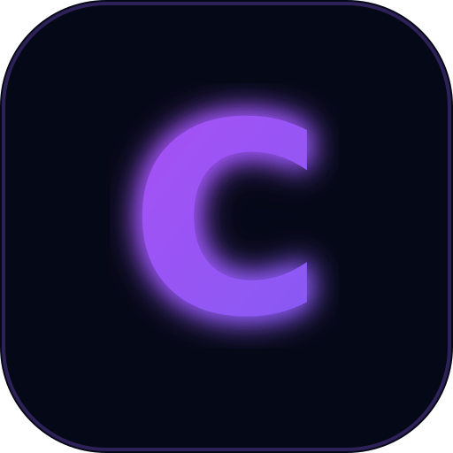
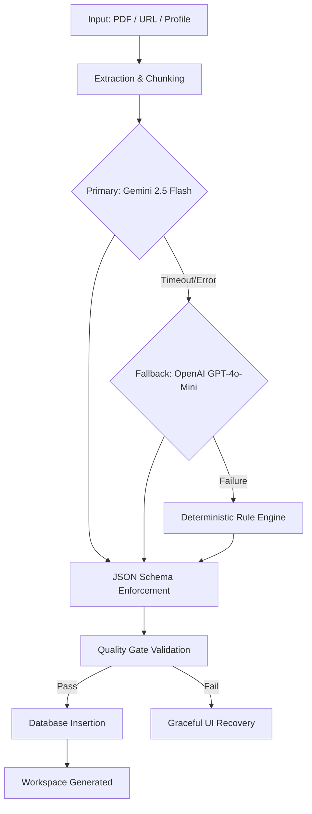

<div align="center">
  
  <h1>ClearPath OS</h1>
  <p><strong>You were never bad at applications. The system was.</strong></p>

  <p>
    A production-grade, AI-powered "Operating System" that transforms confusing educational opportunities, government circulars, and scholarship notices into database-backed, personalized action plans with mathematical readiness scores.
  </p>

  <div>
    
    
    
    
  </div>
</div>

---

## Table of Contents
- [The Problem](#the-problem)
- [How ClearPath OS Solves It](#how-clearpath-os-solves-it)
- [Core Architecture](#core-architecture)
- [The AI Orchestrator Pipeline](#the-ai-orchestrator-pipeline)
- [Product Walkthrough](#product-walkthrough)
- [Technology Stack](#technology-stack)
- [Getting Started](#getting-started)
- [USAII Challenge Alignment](#usaii-challenge-alignment)

---

## The Problem

Every year, millions of dollars in scholarships, grants, and educational programs go unclaimed. Not because students lack eligibility, but because:

▪ Requirements are buried deep inside 40-page PDF legal documents.
▪ Deadlines and hidden prerequisites are easily missed.
▪ Discovering what documents are missing happens *after* starting the application.
▪ High-stress environments prevent effective execution.

Existing solutions just offer "search engines" for scholarships. **ClearPath OS acts as an execution workspace.**

---

## How ClearPath OS Solves It

ClearPath OS is not a document viewer or a chatbot wrapper. It is a **Single Source of Truth** system that binds a user's verified identity to unstructured documents.

**1. Document Vault**
Upload core identity documents (Aadhaar, Income Certificates, Transcripts) securely.

**2. AI Orchestrator**
Upload any complex PDF or URL. ClearPath uses Gemini 2.5 Flash and OpenAI to extract strict schemas (Title, Deadlines, Missing Docs, Actions).

**3. Mathematical Readiness**
The engine cross-references the extracted requirements against your Document Vault. If the scholarship requires an Aadhaar and an Income Certificate, and your Vault has both, your Readiness Score is instantly computed to 100%.

**4. Action Checklists**
The OS generates step-by-step checklists, ensuring human-in-the-loop verification before any application is submitted.

---

## Core Architecture

ClearPath OS is built on a highly relational, strict database architecture:

▪ **Global Match Engine:** The central `global_opportunities` table stores all national/state schemes. When a user updates their profile (e.g. State: West Bengal, Income: < 2.5L), the UI instantly recalculates Live Matches using raw SQL counts.
▪ **Usage Telemetry:** A built-in Security Center tracks API usage limits. Every time the Orchestrator analyzes a document, it logs a transaction in the `usage_logs` table, displaying true metrics on the dashboard.
▪ **Global Theming Engine:** System appearance (Light/Dark) is pulled directly from the `user_preferences` database schema and enforced globally via the server component layout.
▪ **Robust Failure States:** The AI pipeline features graceful fallbacks, catching unreadable documents (like general school notices) and recovering gracefully without crashing the UI.

---

## The AI Orchestrator Pipeline

The backend processing pipeline is engineered for extreme reliability and deterministic output. 



**Key Features:**
▪ **Strict Zod Schemas:** AI is forbidden from hallucinating. If it cannot find a deadline, it returns `null`.
▪ **Evidence Linked:** Every extracted requirement contains an exact string match/quote from the source document to verify accuracy.
▪ **Adaptive Timeouts:** The backend dynamically calculates AI response limits based on document length.

---

## Product Walkthrough

**1. The Dashboard**
Your command center. It joins your `opportunities` table and `document_vault` to show exactly how many documents you are currently missing across all active applications.

**2. Workspace Directory**
A grid displaying analyzed opportunities sorted by mathematical Readiness Scores and AI-calculated Priority.

**3. The Analyzer**
Upload documents via drag-and-drop or submit a URL. Watch the State Machine transition through *Extracting Intelligence -> Generating Action Plan -> Creating Workspace*.

**4. Execution Hub**
Dive into an opportunity to view the simplified plain-language summary, exact requirements, missing documents, and check off the executable timeline.

**5. Security Center**
Manage your API keys, track your session history, and view your precise token/generation usage across all AI providers.

---

## Technology Stack

▪ **Frontend:** Next.js 15 (App Router), React 19, TailwindCSS, Framer Motion
▪ **Design System:** Custom Glassmorphic UI with dynamic neon styling and compact data density.
▪ **Backend/Database:** Supabase (PostgreSQL), Next.js Server Actions
▪ **AI Models:** Google Gemini 2.5 Flash, OpenAI `gpt-4o-mini`
▪ **Validation:** Zod schemas
▪ **File Parsing:** `pdf-parse`, HTML scraping.

---

## Getting Started

### Prerequisites
▪ Node.js 18+
▪ Supabase Project (with `opportunities` and `document-vault` storage buckets configured)
▪ Google Gemini API Key
▪ OpenAI API Key (Optional fallback)

### Installation

1. Clone the repository:
   ```bash
   git clone https://github.com/Kaustavoffx/Clearpath-Ai.git
   cd clearpath-ai
   ```

2. Install dependencies:
   ```bash
   npm install
   ```

3. Setup environment variables (`.env.local`):
   ```env
   NEXT_PUBLIC_SUPABASE_URL=your_url
   NEXT_PUBLIC_SUPABASE_ANON_KEY=your_key
   GEMINI_API_KEY=your_key
   OPENAI_API_KEY=your_key
   ```

4. Run database migrations:
   Apply all 16 SQL migrations in `/supabase/migrations` sequentially to build the Single Source of Truth architecture.

5. Start the development server:
   ```bash
   npm run dev
   ```

---

## USAII Challenge Alignment

▪ **Track:** High School (Grades 9–12)
▪ **Challenge:** Help is Hard to Find
▪ **Direction:** A — Crisis-to-Action Translator

> **We believe opportunity loss is a design problem.**
> Students are not failing because they lack ambition. They are failing because bureaucratic systems were never designed for people under stress. ClearPath OS transforms that complexity into executable action.

<div align="center">
  <p><strong>Mission:</strong> Reduce confusion. Increase readiness. Guarantee action.</p>
</div>